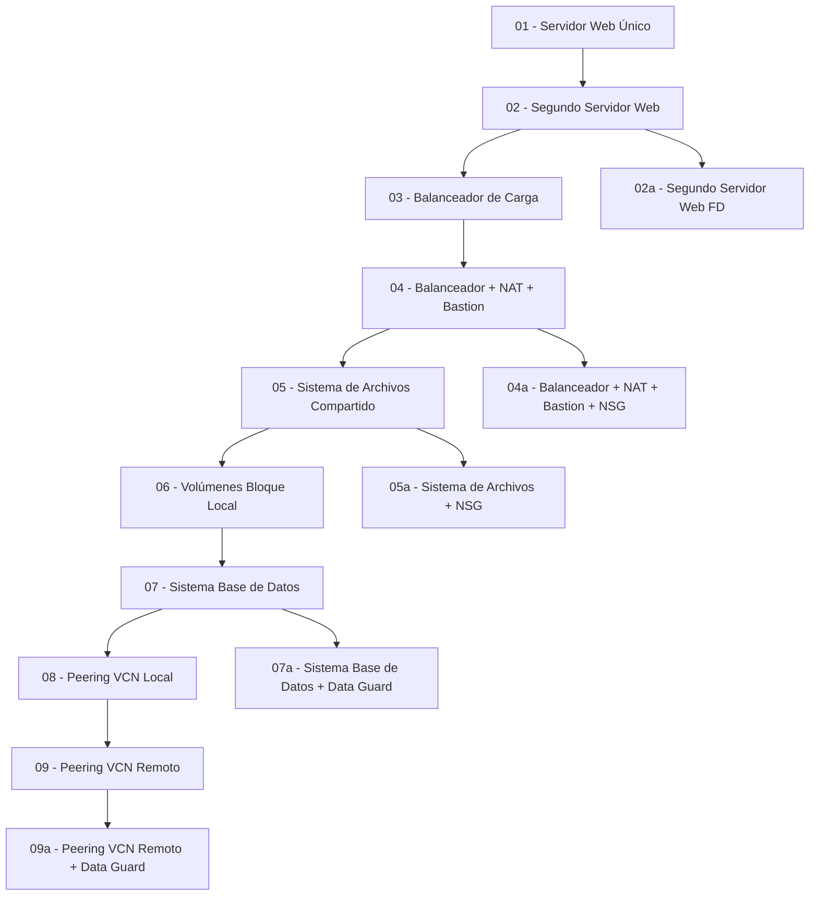

# 🏗️ OCI Terraform Foundations - Arquitecturas de Referencia

[](https://www.terraform.io/)
[](https://opentofu.org/)
[](https://www.oracle.com/cloud/)
[](https://www.ansible.com/)
[](LICENSE)

## 📋 Descripción del Proyecto

Este repositorio contiene **14 arquitecturas progresivas** de referencia basadas en Terraform para Oracle Cloud Infrastructure (OCI), diseñadas como plantillas base seguras y escalables para implementaciones empresariales. Cada arquitectura construye sobre la anterior, introduciendo conceptos más avanzados de infraestructura como código y siguiendo las mejores prácticas de seguridad cloud-native.

### ✨ Características Principales

- 🚀 **One-Click Deploy** - Botones de despliegue directo con Oracle Resource Manager
- 🔒 **Seguridad por Diseño** - Network Security Groups, bastion hosts y principio de menor privilegio
- ⚡ **Aprovisionamiento Automatizado** - Ansible integrado para configuración automática de software
- 🌍 **Multi-Región** - Arquitecturas cross-region con disaster recovery
- 📚 **Documentación Completa** - Guías detalladas con diagramas ASCII y troubleshooting
- 🏗️ **Arquitecturas Empresariales** - Patrones probados para aplicaciones de producción

### 🎯 Objetivos de las Arquitecturas de Referencia

- **Arquitecturas Base Seguras** con patrones probados para OCI usando Terraform/OpenTofu
- **Progresión incremental** desde conceptos básicos hasta arquitecturas empresariales complejas
- **Mejores prácticas** de seguridad cloud-native, alta disponibilidad y escalabilidad automática
- **Plantillas listas para producción** de patrones arquitectónicos empresariales
- **Compliance y seguridad** siguiendo los marcos de trabajo de Oracle Well-Architected Framework

## 🏗️ Arquitecturas Disponibles

### 📚 Nivel Básico - Fundamentos

| Arquitectura | Descripción | Complejidad | Deploy |
|--------------|-------------|-------------|---------|
| [01 - Servidor Web Único](01_servidor_web_unico/) | Servidor web básico en subred pública con seguridad multi-capa | ⭐ | [](https://cloud.oracle.com/resourcemanager/stacks/create?region=home&zipUrl=https://github.com/jesmonsa/01-oci-terraform-foundations/archive/refs/heads/main.zip) |
| [02 - Segundo Servidor Web](02_segundo_servidor_web_en_otro_AD/) | Alta disponibilidad entre Availability Domains con NSGs | ⭐⭐ | [](https://cloud.oracle.com/resourcemanager/stacks/create?region=home&zipUrl=https://github.com/jesmonsa/01-oci-terraform-foundations/archive/refs/heads/main.zip) |
| [02a - Segundo Servidor Web (FD)](02a_segundo_servidor_web_en_otro_FD/) | Alta disponibilidad entre Fault Domains para regiones single-AD | ⭐⭐ | [](https://cloud.oracle.com/resourcemanager/stacks/create?region=home&zipUrl=https://github.com/jesmonsa/01-oci-terraform-foundations/archive/refs/heads/main.zip) |

### 🔄 Nivel Intermedio - Balanceo y Seguridad

| Arquitectura | Descripción | Complejidad | Deploy |
|--------------|-------------|-------------|---------|
| [03 - Balanceador de Carga](03_balanceador_de_carga/) | Load balancer con múltiples servidores y health checks | ⭐⭐⭐ | [](https://cloud.oracle.com/resourcemanager/stacks/create?region=home&zipUrl=https://github.com/jesmonsa/01-oci-terraform-foundations/archive/refs/heads/main.zip) |
| [04 - Balanceador + NAT + Bastion](04_balanceador_NAT_bastion/) | Arquitectura segura con subredes privadas y bastion host | ⭐⭐⭐⭐ | [](https://cloud.oracle.com/resourcemanager/stacks/create?region=home&zipUrl=https://github.com/jesmonsa/01-oci-terraform-foundations/archive/refs/heads/main.zip) |
| [04a - Balanceador + NAT + Bastion + NSG](04a_balanceador_NAT_bastion_grupos_seguridad/) | Seguridad avanzada con Network Security Groups granulares | ⭐⭐⭐⭐ | [](https://cloud.oracle.com/resourcemanager/stacks/create?region=home&zipUrl=https://github.com/jesmonsa/01-oci-terraform-foundations/archive/refs/heads/main.zip) |

### 💾 Nivel Avanzado - Almacenamiento y Base de Datos

| Arquitectura | Descripción | Complejidad | Deploy |
|--------------|-------------|-------------|---------|
| [05 - Sistema de Archivos Compartido](05_sistema_archivos_compartido/) | File Storage Service (FSS) compartido entre servidores | ⭐⭐⭐ | [](https://cloud.oracle.com/resourcemanager/stacks/create?region=home&zipUrl=https://github.com/jesmonsa/01-oci-terraform-foundations/archive/refs/heads/main.zip) |
| [05a - Sistema de Archivos + NSG](05a_sistema_archivos_compartido_grupos_seguridad/) | File Storage con Network Security Groups avanzados | ⭐⭐⭐⭐ | [](https://cloud.oracle.com/resourcemanager/stacks/create?region=home&zipUrl=https://github.com/jesmonsa/01-oci-terraform-foundations/archive/refs/heads/main.zip) |
| [06 - Volúmenes Bloque Local](06_volumenes_bloque_local/) | Block Storage para almacenamiento persistente de alto rendimiento | ⭐⭐⭐ | [](https://cloud.oracle.com/resourcemanager/stacks/create?region=home&zipUrl=https://github.com/jesmonsa/01-oci-terraform-foundations/archive/refs/heads/main.zip) |
| [07 - Sistema Base de Datos](07_sistema_base_datos/) | Oracle Database System en subred privada segura | ⭐⭐⭐⭐ | [](https://cloud.oracle.com/resourcemanager/stacks/create?region=home&zipUrl=https://github.com/jesmonsa/01-oci-terraform-foundations/archive/refs/heads/main.zip) |
| [07a - Sistema Base de Datos + DataGuard](07a_sistema_base_datos_con_dataguard/) | Alta disponibilidad con Oracle DataGuard automático | ⭐⭐⭐⭐⭐ | [](https://cloud.oracle.com/resourcemanager/stacks/create?region=home&zipUrl=https://github.com/jesmonsa/01-oci-terraform-foundations/archive/refs/heads/main.zip) |

### 🌐 Nivel Experto - Conectividad Avanzada

| Arquitectura | Descripción | Complejidad | Deploy |
|--------------|-------------|-------------|---------|
| [08 - Peering VCN Local](08_peering_vcn_local/) | Conectividad entre VCNs en la misma región con DRGs | ⭐⭐⭐⭐ | [](https://cloud.oracle.com/resourcemanager/stacks/create?region=home&zipUrl=https://github.com/jesmonsa/01-oci-terraform-foundations/archive/refs/heads/main.zip) |
| [09 - Peering VCN Remoto](09_peering_vcn_remoto/) | Conectividad cross-region con Remote Peering Connections | ⭐⭐⭐⭐⭐ | [](https://cloud.oracle.com/resourcemanager/stacks/create?region=home&zipUrl=https://github.com/jesmonsa/01-oci-terraform-foundations/archive/refs/heads/main.zip) |
| [09a - Peering VCN Remoto + DataGuard](09a_peering_vcn_remoto_con_dataguard/) | Disaster Recovery multi-región con DataGuard cross-region | ⭐⭐⭐⭐⭐ | [](https://cloud.oracle.com/resourcemanager/stacks/create?region=home&zipUrl=https://github.com/jesmonsa/01-oci-terraform-foundations/archive/refs/heads/main.zip) |

## 🛣️ Progresión de Arquitecturas de Referencia



## 🚀 Inicio Rápido

### Prerrequisitos

- **Terraform >= 0.15.0** o **OpenTofu >= 1.0.0**
- **Ansible >= 2.9** (para aprovisionamiento automático)
- **Cuenta de OCI** con permisos de administrador
- **OCI CLI** configurado (opcional)
- **Git** para clonar el repositorio

### Configuración Inicial

1. **Clonar el repositorio:**
```bash
git clone https://github.com/jesmonsa/01-oci-terraform-foundations.git
cd 01-oci-terraform-foundations
```

2. **Configurar variables de entorno:**
```bash
# Crear archivo de configuración
cat > setup_oci_tf_vars.sh << 'EOF'
export TF_VAR_user_ocid="ocid1.user.oc1..aaaaaaaa..."
export TF_VAR_tenancy_ocid="ocid1.tenancy.oc1..aaaaaaaas..."
export TF_VAR_compartment_ocid="ocid1.compartment.oc1..aaaaaaaas..."
export TF_VAR_fingerprint="00:f9:d1:41:bb:57..."
export TF_VAR_private_key_path="/path/to/oci_api_key.pem"
export TF_VAR_region="eu-frankfurt-1"
export TF_VAR_private_key_oci="/path/to/id_rsa"
export TF_VAR_public_key_oci="/path/to/id_rsa.pub"
EOF

# Cargar variables
source setup_oci_tf_vars.sh
```

3. **Seleccionar arquitectura:**
```bash
cd 01_servidor_web_unico
```

4. **Desplegar infraestructura:**
```bash
terraform init
terraform plan
terraform apply
```

## 🔧 Métodos de Despliegue

### 1. Terraform/OpenTofu CLI
```bash
terraform init
terraform plan
terraform apply
terraform destroy
```

### 2. Oracle Resource Manager
- Subir el código como stack en OCI Resource Manager
- Configurar variables a través de la interfaz web
- Desplegar con un clic

### 3. CI/CD Pipeline
- Integrar con GitHub Actions, GitLab CI, o Jenkins
- Automatizar despliegues con variables de entorno
- Implementar validaciones y tests

## 🔐 Autenticación y Seguridad

### Métodos de Autenticación

1. **API Key Authentication** (Recomendado)
   - Generar par de claves en OCI Console
   - Configurar fingerprint y private key path

2. **Instance Principal** (Para instancias OCI)
   - Usar metadata de la instancia
   - Sin necesidad de claves API

3. **Service Principal** (Para CI/CD)
   - Configurar políticas específicas
   - Usar tokens de servicio

### Mejores Prácticas de Seguridad

- ✅ Usar Network Security Groups (NSG)
- ✅ Implementar subredes privadas
- ✅ Configurar bastion hosts
- ✅ Aplicar principio de menor privilegio
- ✅ Rotar claves regularmente
- ✅ Habilitar logging y monitoreo

## 📊 Recursos Desplegados

Cada arquitectura incluye:

| Tipo de Recurso | Descripción |
|-----------------|-------------|
| **Compute** | Instancias VM con diferentes configuraciones |
| **Networking** | VCNs, subredes, route tables, security lists |
| **Load Balancer** | Balanceadores de carga con health checks |
| **Storage** | Block volumes, File Storage, Object Storage |
| **Database** | Oracle Database Systems con Data Guard |
| **Security** | Network Security Groups, bastion hosts |
| **Connectivity** | Local/Remote VCN peering, NAT gateways |

## 🎓 Conceptos Aprendidos

### Networking
- Virtual Cloud Networks (VCN)
- Subredes públicas y privadas
- Route tables y security lists
- Network Security Groups
- VCN peering (local y remoto)
- NAT gateways y bastion hosts

### Compute
- Instancias de compute
- Availability Domains y Fault Domains
- Load balancers y health checks
- Auto-scaling y alta disponibilidad

### Storage
- Block volumes locales
- File Storage compartido
- Object Storage
- Backup y recuperación

### Database
- Oracle Database Systems
- Data Guard para alta disponibilidad
- Subredes de base de datos
- Configuración de seguridad

### Security
- Principio de menor privilegio
- Network Security Groups
- Bastion hosts
- Encriptación en tránsito y en reposo

## 🛠️ Personalización

### Variables Comunes

```hcl
# Configuración de región
variable "region" {
  description = "Región de OCI"
  default     = "eu-frankfurt-1"
}

# Configuración de instancias
variable "instance_shape" {
  description = "Shape de las instancias"
  default     = "VM.Standard2.1"
}

# Configuración de red
variable "vcn_cidr" {
  description = "CIDR de la VCN"
  default     = "10.0.0.0/16"
}
```

### Adaptaciones Recomendadas

1. **Cambiar regiones** según ubicación geográfica
2. **Ajustar shapes** según requisitos de rendimiento
3. **Modificar CIDRs** para evitar conflictos
4. **Personalizar tags** para organización
5. **Configurar monitoring** y alertas

## 🔍 Monitoreo y Troubleshooting

### Logs Importantes

```bash
# Logs de Terraform
terraform logs

# Logs de OCI
oci logging log-entry list --log-group-id <log-group-id>

# Logs de instancias
ssh -i private_key opc@<instance-ip> "sudo journalctl -f"
```

### Comandos de Diagnóstico

```bash
# Verificar conectividad
ping <instance-ip>
telnet <instance-ip> <port>

# Verificar configuración de red
oci network vcn get --vcn-id <vcn-id>
oci network subnet list --compartment-id <compartment-id>

# Verificar estado de recursos
terraform show
terraform state list
```

## 📚 Recursos Adicionales

### Documentación Oficial
- [OCI Terraform Provider](https://registry.terraform.io/providers/oracle/oci/latest/docs)
- [OCI Documentation](https://docs.oracle.com/en-us/iaas/Content/home.htm)
- [Terraform Documentation](https://www.terraform.io/docs)

### Herramientas Recomendadas
- [OCI CLI](https://docs.oracle.com/en-us/iaas/Content/API/SDKDocs/cliinstall.htm)
- [OCI Cloud Shell](https://docs.oracle.com/en-us/iaas/Content/API/Concepts/cloudshellintro.htm)
- [Terraform Cloud](https://www.terraform.io/cloud)

### Comunidad
- [OCI Community](https://community.oracle.com/tech/developers/categories/cloud-infrastructure)
- [Terraform Community](https://discuss.hashicorp.com/c/terraform-core/27)

## 🤝 Contribuciones

¡Las contribuciones son bienvenidas! Por favor:

1. Fork el repositorio
2. Crear una rama para tu feature (`git checkout -b feature/AmazingFeature`)
3. Commit tus cambios (`git commit -m 'Add some AmazingFeature'`)
4. Push a la rama (`git push origin feature/AmazingFeature`)
5. Abrir un Pull Request

## 📄 Licencia

Este proyecto está bajo la Licencia MIT. Ver el archivo [LICENSE](LICENSE) para más detalles.

## 👨‍💻 Créditos

- **Basado en:** [Foggykitchen OCI Terraform Course](https://github.com/mlinxfeld/foggykitchen_tf_oci_course)
- **Adaptado y mejorado por:** Jesus Montoya, Arquitecto Cloud
- **Contribuidores:** Comunidad OCI y Terraform

## 📞 Soporte

- **Issues:** [GitHub Issues](https://github.com/jesmonsa/01-oci-terraform-foundations/issues)
- **Discusiones:** [GitHub Discussions](https://github.com/jesmonsa/01-oci-terraform-foundations/discussions)
- **LinkedIn:** [Jesus Montoya - Arquitecto Cloud](https://linkedin.com/in/jesmonsa)

---

⭐ **¡No olvides dar una estrella al repositorio si te ha sido útil!**
